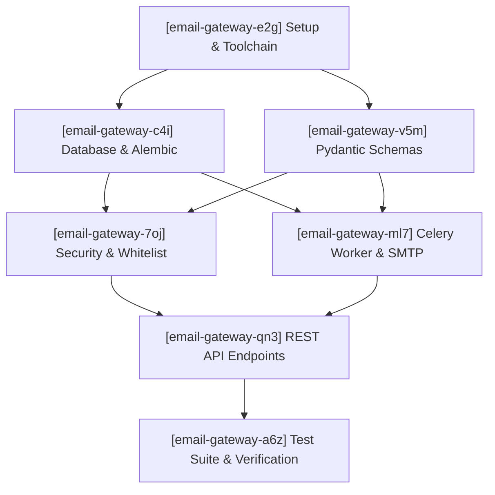

# Claim Order & Implementation Monitoring Checklist

Dokumen ini adalah panduan urutan pengerjaan (*claim order*) dan monitor status implementasi Centralized Email Gateway API. Dirancang untuk dieksekusi secara terurut oleh *coding agent* (khususnya yang menggunakan *local model*) tanpa ambiguitas dan tanpa ketergantungan instruksi kode mentah.

---

## 🗺️ Dependency Graph (Urutan Eksekusi)

Setiap issue hanya boleh diklaim setelah seluruh dependensi prasyaratnya berstatus **[x] Done**.

---

## 📋 Checklist Claim Order

| Urutan | ID Issue Beads | Prioritas | Judul Tugas | Dependensi | Status |
| :---: | :---: | :---: | :--- | :---: | :---: |
| 1 | `email-gateway-e2g` | P1 | Konfigurasi Lingkungan, Toolchain uv, Dependensi, dan Observabilitas | *None* | `[x] Done` |
| 2 | `email-gateway-c4i` | P1 | Model Database Relasional (SQLAlchemy) & Skema Migrasi (Alembic) | `email-gateway-e2g` | `[x] Done` |
| 3 | `email-gateway-v5m` | P2 | Skema Validasi Kontrak Data (Pydantic V2) & Batasan Ukuran Payload | `email-gateway-e2g` | `[x] Done` |
| 4 | `email-gateway-7oj` | P2 | Lapisan Keamanan, Autentikasi Klien (X-API-Key), & Otorisasi Alamat Pengirim | `email-gateway-c4i`, `email-gateway-v5m` | `[x] Done` |
| 5 | `email-gateway-ml7` | P3 | Worker Asinkron (Celery) & Mesin Pengiriman SMTP (Connection-per-Task) | `email-gateway-c4i`, `email-gateway-v5m` | `[x] Done` |
| 6 | `email-gateway-qn3` | P3 | Implementasi REST API Routing (Pengiriman Email & Pelacakan Status) | `email-gateway-7oj`, `email-gateway-ml7` | `[x] Done` |
| 7 | `email-gateway-a6z` | P4 | Pengujian Terotomatisasi (Pytest) & Verifikasi Kualitas Keseluruhan | `email-gateway-qn3` | `[x] Done` |

---

## 🔍 Detail Spesifikasi Setiap Tahapan Kerja

### 1. [x] `email-gateway-e2g` — Konfigurasi Lingkungan, Toolchain uv, Dependensi, dan Observabilitas
- **Perintah Klaim**: `bd update email-gateway-e2g --claim`
- **Prasyarat**: Tidak ada.
- **Tujuan**: Membangun struktur proyek dasar, dependensi Python, konfigurasi logging, dan container database/broker pendukung.
- **Komponen Utama**:
  - Konfigurasi `pyproject.toml` menggunakan `uv` mencakup seluruh dependensi runtime dan grup dev (`fastapi`, `uvicorn[standard]`, `pydantic[email]`, `pydantic-settings`, `sqlalchemy`, `psycopg2-binary`, `alembic`, `celery[redis]`, `redis`, `structlog`, `pytest`, `httpx`, `pytest-mock`).
  - Berkas `.env.example` sebagai referensi konfigurasi environment.
  - Modul inisialisasi `structlog` (format JSON untuk produksi, format konsol untuk lokal).
  - Berkas `docker-compose.yml` untuk PostgreSQL 16 dan Redis 7.
- **Verifikasi**:
  - `uv sync` berhasil tanpa galat.
  - Layanan Redis dan PostgreSQL dapat dijalankan via Docker Compose.
- **Penyelesaian**: `bd close email-gateway-e2g`

---

### 2. [x] `email-gateway-c4i` — Model Database Relasional (SQLAlchemy) & Skema Migrasi (Alembic)
- **Perintah Klaim**: `bd update email-gateway-c4i --claim`
- **Prasyarat**: `email-gateway-e2g` selesai.
- **Tujuan**: Menyediakan skema database PostgreSQL dan migrasi awal untuk tabel identitas klien dan log audit transaksi.
- **Komponen Utama**:
  - Modul koneksi database synchronous (`database.py`) dengan engine dan SessionLocal.
  - Model `ApiKey` (`models.py`): UUID, token kunci, nama klien, daftar whitelist pengirim (`allowed_from_addresses`), status aktif, timestamp.
  - Model `MailTransaction` (`models.py`): UUID, task_id, client_id, from_address, to_addresses, cc_addresses, subject, attachment_count, status, error_message, retry_count, created_at, delivered_at (tanpa konten body & data biner lampiran).
  - Konfigurasi dan migrasi awal Alembic (`alembic/`).
- **Verifikasi**:
  - Migrasi Alembic berjalan sukses (`uv run alembic upgrade head`).
  - Struktur tabel terbentuk sesuai spesifikasi skema relasional.
- **Penyelesaian**: `bd close email-gateway-c4i`

---

### 3. [x] `email-gateway-v5m` — Skema Validasi Kontrak Data (Pydantic V2) & Batasan Ukuran Payload
- **Perintah Klaim**: `bd update email-gateway-v5m --claim`
- **Prasyarat**: `email-gateway-e2g` selesai.
- **Tujuan**: Menjamin integritas payload HTTP, format email yang valid, ketersediaan konten, dan penolakan payload berukuran berlebih.
- **Komponen Utama**:
  - Skema data `Attachment` (`filename`, `content_type`, `base64_data`).
  - Skema data `EmailPayload` (`to`, `cc`, `from_address` wajib, `subject`, `text_content`, `html_content`, `attachments`).
  - Validasi keberadaan minimal salah satu konten (`text_content` atau `html_content`).
  - Validasi batas ukuran total payload maksimum 15 MB (estimasi raw file ~10.5 MB) dihitung dari panjang data Base64.
  - Skema data respons penerimaan (202 Accepted) dan pelacakan status (200 OK).
- **Verifikasi**:
  - Pengujian parsing skema menerima data valid dan menolak data malformed, tanpa body, atau melebihi 15 MB.
- **Penyelesaian**: `bd close email-gateway-v5m`

---

### 4. [x] `email-gateway-7oj` — Lapisan Keamanan, Autentikasi Klien (X-API-Key), & Otorisasi Alamat Pengirim
- **Perintah Klaim**: `bd update email-gateway-7oj --claim`
- **Prasyarat**: `email-gateway-c4i` dan `email-gateway-v5m` selesai.
- **Tujuan**: Mengotentikasi pemanggil API via header `X-API-Key` dan memverifikasi bahwa pengirim hanya menggunakan alamat yang diizinkan.
- **Komponen Utama**:
  - Dependency keamanan FastAPI untuk membaca dan mencocokkan `X-API-Key` ke database tabel `api_keys`.
  - Penolakan HTTP 401 jika API key tidak ditemukan atau berstatus non-aktif.
  - Pemeriksaan otorisasi pengirim: `from_address` dari payload wajib ada di dalam `allowed_from_addresses` milik klien.
  - Penolakan HTTP 403 jika `from_address` tidak berhak digunakan oleh klien.
- **Verifikasi**:
  - Permintaan dengan key salah mengembalikan status HTTP 401.
  - Permintaan dengan sender ilegal mengembalikan status HTTP 403.
  - Permintaan terotorisasi lolos ke tahap pemrosesan berikutnya.
- **Penyelesaian**: `bd close email-gateway-7oj`

---

### 5. [x] `email-gateway-ml7` — Worker Asinkron (Celery) & Mesin Pengiriman SMTP (Connection-per-Task)
- **Perintah Klaim**: `bd update email-gateway-ml7 --claim`
- **Prasyarat**: `email-gateway-c4i` dan `email-gateway-v5m` selesai.
- **Tujuan**: Mengeksekusi pengiriman email melalui SMTP dengan pola koneksi per-task, isolasi kegagalan, dan retry teratur.
- **Komponen Utama**:
  - Konfigurasi aplikasi Celery dengan Redis broker (`worker/celery_app.py`).
  - Task pengiriman email (`worker/tasks.py`):
    - Membuka koneksi SMTP ber-TLS dengan batas waktu timeout 15 detik menggunakan context manager.
    - Merakit pesan MIME multipart beserta lampiran yang didekode dari Base64.
    - Mengirim pesan dan menutup koneksi secara otomatis.
    - Memperbarui rekaman `MailTransaction` ke status `sent` beserta `delivered_at`.
  - Logika error handling & retry:
    - Respon SMTP 552 (Permanent Failure): langsung ubah status menjadi `failed`, tanpa retry.
    - Gangguan sementara (Timeout/Connection Refused): jadwalkan retry dengan jeda waktu [60s, 300s, 900s] (maksimal 3x retry). Perbarui `retry_count` di database.
- **Verifikasi**:
  - Worker berhasil memproses antrean email dan memperbarui rekaman di database.
  - Respon error 552 tidak mengalami perulangan (retry dibatalkan).
- **Penyelesaian**: `bd close email-gateway-ml7`

---

### 6. [x] `email-gateway-qn3` — Implementasi REST API Routing (Pengiriman Email & Pelacakan Status)
- **Perintah Klaim**: `bd update email-gateway-qn3 --claim`
- **Prasyarat**: `email-gateway-7oj` dan `email-gateway-ml7` selesai.
- **Tujuan**: Menyediakan antarmuka HTTP REST API untuk menerima permintaan pengiriman email dan melayani query status.
- **Komponen Utama**:
  - Endpoint `POST /api/v1/emails/send`:
    - Validasi keamanan dan payload.
    - Membuat rekaman `MailTransaction` berstatus `queued`.
    - Mengirim job ke antrean Celery secara non-blocking.
    - Mengembalikan respons segera status HTTP 202 Accepted beserta `task_id`.
  - Endpoint `GET /api/v1/emails/{task_id}`:
    - Validasi autentikasi pemanggil.
    - Mengambil data transaksi berdasarkan `task_id` yang terisolasi per client.
    - Mengembalikan status terkini (`queued`, `sent`, `failed`), `retry_count`, `error_message`, dan timestamp.
    - Mengembalikan HTTP 404 jika transaksi tidak ditemukan atau bukan milik klien pemanggil.
- **Verifikasi**:
  - Respons `POST /send` diterima seketika (<100ms) dengan status HTTP 202.
  - Respons `GET /{task_id}` mencerminkan status aktual pada database.
- **Penyelesaian**: `bd close email-gateway-qn3`

---

### 7. [x] `email-gateway-a6z` — Pengujian Terotomatisasi (Pytest) & Verifikasi Kualitas Keseluruhan
- **Perintah Klaim**: `bd update email-gateway-a6z --claim`
- **Prasyarat**: `email-gateway-qn3` selesai.
- **Tujuan**: Memastikan keandalan seluruh fungsi sistem melalui suite pengujian otomatis.
- **Komponen Utama**:
  - Unit tests untuk skema Pydantic (validasi field, batas ukuran 15 MB, validasi body).
  - Integration tests untuk endpoint FastAPI (skenario sukses 202, penolakan 401 dan 403, pelacakan 200, penolakan 404).
  - Mock tests untuk worker Celery dan interaksi protokol SMTP (simulasi sukses, permanen 552, retry bertingkat).
  - Pemeriksaan batas baris kode file (<300 LOC per file).
- **Verifikasi**:
  - `uv run pytest` lulus 100%.
- **Penyelesaian**: `bd close email-gateway-a6z`

---

## 📌 Protokol Pengerjaan untuk Agen (Local Model)

1. **Klaim Tugas**:
   - Jalankan `bd update <id> --claim`
   - Perbarui checklist pada tabel monitor di atas dari `[ ] Open` menjadi `[>] In Progress`.
2. **Kepatuhan Arsitektur**: Selalu rujuk [docs/blueprint.md](docs/blueprint.md), [docs/prd.md](docs/prd.md), dan [CONTEXT.md](CONTEXT.md).
3. **Ukuran File**: Target 150–250 baris kode per file. Batas maksimal mutlak adalah 300 baris. Lakukan pemisahan modular jika file mendekati batas.
4. **Toolchain**: Selalu gunakan `uv` (`uv run`, `uv sync`, `uv add`).
5. **Selesaikan Tugas**:
   - Jalankan verifikasi (`uv run pytest`).
   - Tutup issue dengan `bd close <id>`.
   - Ubah status di tabel checklist menjadi `[x] Done` dan lanjutkan ke issue berikutnya sesuai urutan dependensi.
